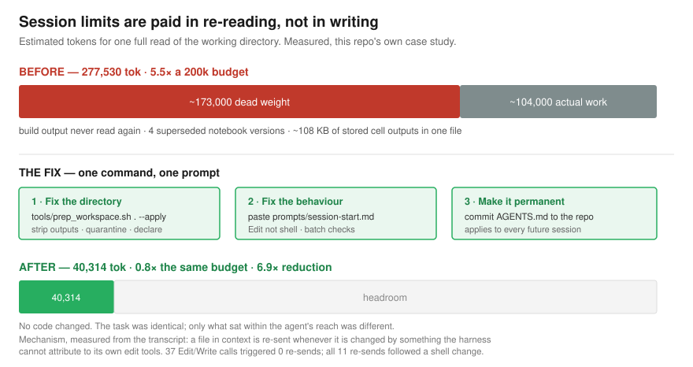
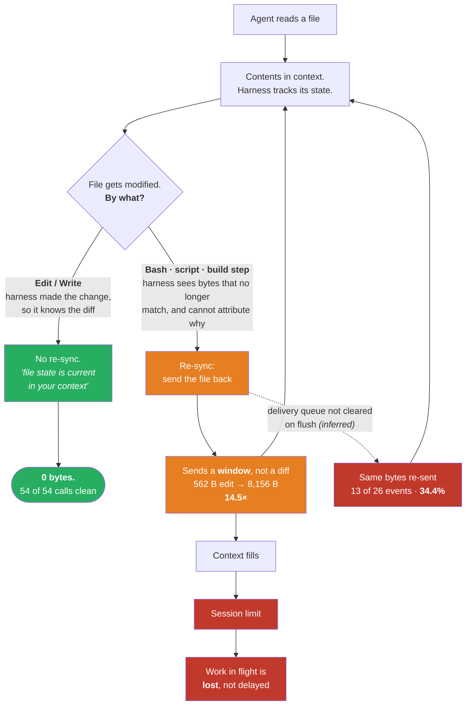
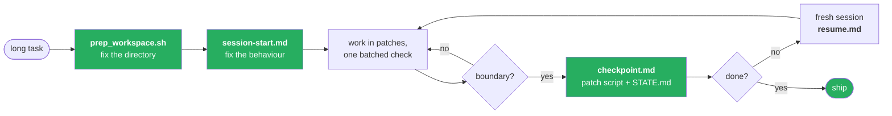

# Surviving session limits in long agentic coding sessions



A field report and a toolkit. During a multi-day task (building and debugging a
scientific-computing benchmark notebook) a Claude Opus 5 Cowork session
repeatedly hit its
session limit mid-work — including killing a sub-agent in the middle of a
measurement run, which destroyed the result rather than merely delaying it.

This repo documents what was actually measured, what the likely mechanism is,
and — the part you probably came for — the concrete changes that stopped it
happening.

## The one-paragraph version

The limit was not being consumed by long answers. It was being consumed by
**re-reading**. Large files in the agent's working directory get pulled back
into context whenever they change on disk, and in a session where the agent is
iteratively editing a 100 KB notebook, that means a six-figure token bill per
turn for work that produced a twenty-line diff. Auditing the working directory
and switching from *rewrite* to *patch* cut the per-turn cost by roughly an
order of magnitude.

## The mechanism in one picture

Everything turns on one fork: **can the harness attribute the change to itself?**



The left branch is the whole mitigation: an `Edit` costs nothing because the
harness already knows what changed. Five more diagrams — where the bytes went,
rebuild vs. patch, the fix as a decision tree, and the shape of a checkpointed
task — are in [`docs/00-diagrams.md`](docs/00-diagrams.md).

## Measured, in the session that prompted this

Running the included auditor against that session's working directory:

```
files scanned              : 36
hot files (>= 4000 tok)    : 15
one full read of hot files : 277,530 tok
worst case over 3 edits    : 1,110,120 tok
vs 200,000-token budget    : 5.5x
```

The four worst offenders were all notebooks the task itself generated:

| file | est. tokens | of which stored outputs |
|---|---|---|
| `executed_solution.ipynb` | 46,641 | ~108 KB of 163 KB |
| `..._length_scale.ipynb` | 34,217 | ~21 KB of 120 KB |
| `task1770.ipynb` | 30,266 | ~27 KB of 106 KB |
| `task1770_patched.ipynb` | 26,161 | — |

`executed_solution.ipynb` was a build artifact. Nothing read it after it was
produced. It sat in the working directory for the entire session as a 46k-token
liability.

## What actually triggers the re-reading

Not a guess — [`docs/07-the-actual-bug.md`](docs/07-the-actual-bug.md) parses
the session transcript and pins it down:

> **A file already in context is re-sent in full whenever it is modified by
> something the harness cannot attribute to its own edit tools** — a shell
> command, a script, a build step.

The control is clean:

| | count |
|---|---:|
| `Edit` / `Write` calls | **54** |
| re-injections that followed one | **0** |
| re-injections of files already in context | **26** |
| bytes re-injected | **114,931** (~32k tokens) |

After an `Edit` the harness reports *"file state is current in your context"* —
it made the change, so it knows. After a shell command it doesn't, so it
resynchronises by re-sending the file. Three consequences, in ascending order
of how much they look like bugs:

1. **The resync is a window, not a diff.** A 562-byte edit to this README cost
   **8,156 bytes** of context — 14.5×. Both versions are known to the harness;
   a diff would carry the same information.
2. **Identical content was re-sent, repeatedly.** Thirteen of twenty-six
   re-injections were byte-identical repeats (same MD5) of files that hadn't
   changed between deliveries. 39,573 bytes — **34.4% of all re-injected
   bytes** — was content the agent already had verbatim. One 665-byte file was
   delivered four separate times.
3. **A read-only operation is the largest trigger.** Fifteen of the twenty-eight
   events follow `SendUserFile`, which modifies nothing at all. A tool that
   cannot dirty a file should never cause a resync — but it can mark a turn
   boundary at which a pending queue flushes.

Reproduce on your own session:

```bash
python3 tools/transcript_forensics.py ~/.claude/projects/*/<session-id>.jsonl
```

**Is it "a bug in Claude Opus 5"?** No — and the distinction matters. Items 2
and 3 look like defects, but they are in the *harness's* file-tracking layer,
not in the model's reasoning. And the largest contributor of all is neither:
it's an oversized working directory plus the choice to edit in-context files
through shell scripts instead of `Edit`. Doc 07 traces the full causal chain
and is honest that only the last two links belong to the harness.

## How to stop it happening — one command and one prompt

**Step 1 — fix the directory.** One command, dry-run by default:

```bash
tools/prep_workspace.sh /path/to/your/project            # show what it would do
tools/prep_workspace.sh /path/to/your/project --apply    # do it
```

It audits, strips notebook outputs, moves large generated files into
`artifacts/` (moves — it never deletes), installs an `AGENTS.md` declaring that
directory off-limits, and re-audits. Run against the directory from this
session:

```
before :  277,530 tok   (5.5x a 200k budget)
after  :   40,314 tok   (0.8x)
```

**6.9× in one command.** Afterwards, look in `artifacts/` and move back
anything you're actually editing — size is a proxy for "generated", and the
script cannot tell your deliverable from a stale build.

**Step 2 — tell the agent the rules.** Paste
[`prompts/session-start.md`](prompts/session-start.md) as your first message.
If you want one sentence instead of a page, use
[`prompts/one-liner.txt`](prompts/one-liner.txt):

> Edit files with the Edit tool, never with shell scripts or heredocs — a
> shell-mediated change to a file you've already read forces the whole file back
> into context. Don't read large files you can change by script instead. Never
> regenerate a file over 20KB. Keep generated artifacts out of the working
> directory. Batch all checks into one command. Before you tell me a report is
> wrong, diff the delivered file against your local copy.

**Step 3 — for a project you'll return to,** commit
[`examples/AGENTS.md.sample`](examples/AGENTS.md.sample) as `AGENTS.md` at the
repo root and stop pasting anything. Most harnesses read it automatically.



That's the whole fix. Everything below is why it works and how it was measured.

### Individual tools

```bash
python3 tools/context_audit.py PATH            # what will this cost me?
python3 tools/nb_strip.py PATH --inplace       # strip notebook outputs
python3 tools/context_audit.py . --budget 200000 || echo "too heavy"
```

`context_audit.py` exits `1` when the modelled worst case exceeds the budget, so
it drops into a Makefile, a pre-commit hook or CI without extra glue.

## Contents

| path | what it is |
|---|---|
| [`docs/00-diagrams.md`](docs/00-diagrams.md) | **Five diagrams** — the problem, its cost, rebuild vs patch, the fix, the shape of a long task |
| [`docs/07-the-actual-bug.md`](docs/07-the-actual-bug.md) | **The forensics** — what triggers re-injection, measured from the transcript |
| [`docs/08-vendor-report.md`](docs/08-vendor-report.md) | Paste-ready bug report, with an explicit list of what it does *not* claim |
| [`docs/09-gemini-cli-runsheet.md`](docs/09-gemini-cli-runsheet.md) | Step-by-step replication on Gemini CLI, using its own telemetry for hard numbers |
| [`docs/10-replication-results.md`](docs/10-replication-results.md) | **The cross-tool table** — one row per harness, null results included |
| [`docs/01-observed-behaviour.md`](docs/01-observed-behaviour.md) | What actually happened, with numbers and timestamps |
| [`docs/02-root-cause.md`](docs/02-root-cause.md) | Mechanism — observation vs. inference, kept separate |
| [`docs/03-mitigations.md`](docs/03-mitigations.md) | The nine changes, ranked by measured effect |
| [`docs/04-reproduction.md`](docs/04-reproduction.md) | How to reproduce and how to measure it yourself |
| [`docs/05-checklist.md`](docs/05-checklist.md) | One-page checklist to paste into your own runbook |
| [`docs/06-when-it-happens.md`](docs/06-when-it-happens.md) | **Incident runbook** — the 90-second landing, and cold recovery with no checkpoint |
| [`prompts/`](prompts/) | **Copy-paste prompts** — session start, mid-session corrections, checkpoint, resume |
| `tools/prep_workspace.sh` | One command that applies the cleanup mitigations |
| `tools/context_audit.py` | Scans a directory, reports re-injection cost |
| `tools/transcript_forensics.py` | Parses a session transcript: where the input tokens actually went |
| `tools/gemini_telemetry_parse.py` | Reads Gemini CLI's OTEL log for per-turn input-token deltas |
| `tools/salvage.py` | Post-kill triage: corrupt files, competing versions, git state |
| `tools/nb_strip.py` | Strips notebook outputs in place |
| `examples/patch_template.py` | Cell-targeted notebook patch script (the rewrite alternative) |
| `examples/AGENTS.md.sample` | Directory conventions that keep the agent out of hot files |
| `.github/workflows/context-budget.yml` | CI job that fails when the repo gets too expensive |

## Measured result

Applying the mitigations in stages to that session's actual directory, with the
auditor re-run after each stage:

| stage | hot tokens, one full read |
|---|---:|
| baseline (working copy, QC harness excluded) | 273,468 |
| delete 6 superseded artifacts | 100,895 |
| strip remaining notebook outputs | 100,880 |
| move generators aside **and declare them off-limits** | 55,418 |

**4.9×**, without changing a line of the actual work. Two of those rows are
nearly flat, and [`docs/03-mitigations.md`](docs/03-mitigations.md) explains why
rather than hiding it — the second and third mitigations overlap, and moving
files into a subdirectory achieves nothing unless the agent is told to skip it.

(The 273,468 baseline is measured on a copy with the QC harness subdirectory
excluded; the 277,530 figure at the top of this page is the full directory.
Same directory, 1.5% apart — the staged run used a copy so the original was not
mutated.)

## The short list, if you read nothing else

1. Never leave a large generated artifact in the agent's working directory.
2. Strip notebook outputs before an agent touches the notebook.
3. Emit a **patch script**, not a rewritten file — it is smaller, reviewable,
   and re-runnable after the session dies.
4. Do verification **in-process**, not in sub-agents; sub-agents are the first
   thing a limit kills, and a half-finished measurement tells you nothing.
5. Batch verification into one command instead of ten.
6. Delete intermediates the moment they are consumed.
7. Checkpoint by delivering a re-runnable artifact, then start a fresh session.

**And if it hits anyway:** don't tell a fresh session to "carry on". Run
`python3 tools/salvage.py . --write-state` first — an abrupt kill leaves
half-written files, and an agent editing on top of corruption produces
confident nonsense. Full runbook in
[`docs/06-when-it-happens.md`](docs/06-when-it-happens.md).

## Licence

MIT. See [LICENSE](LICENSE).
