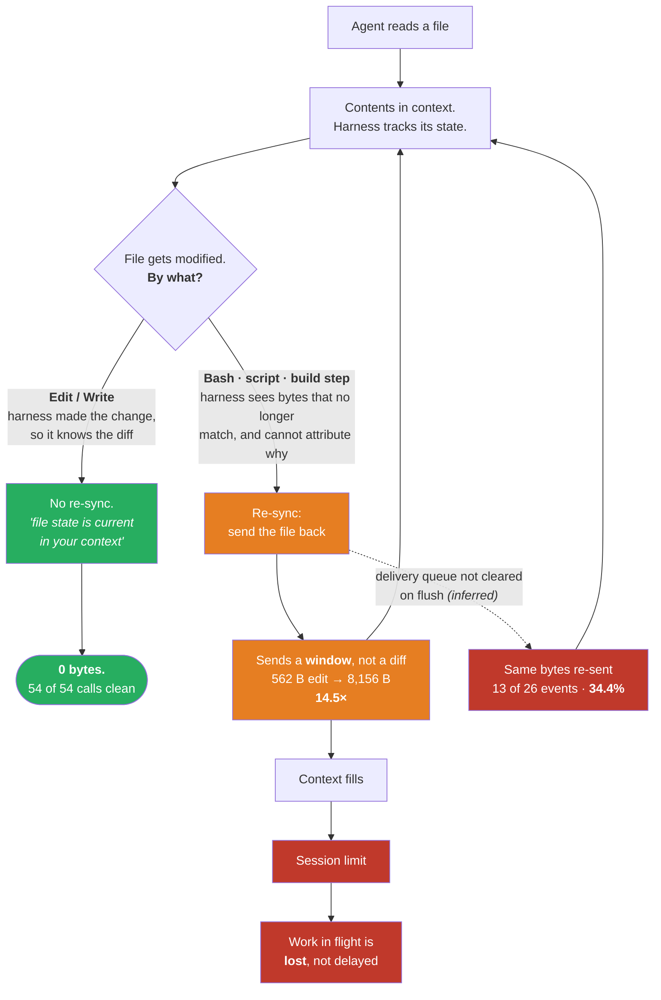
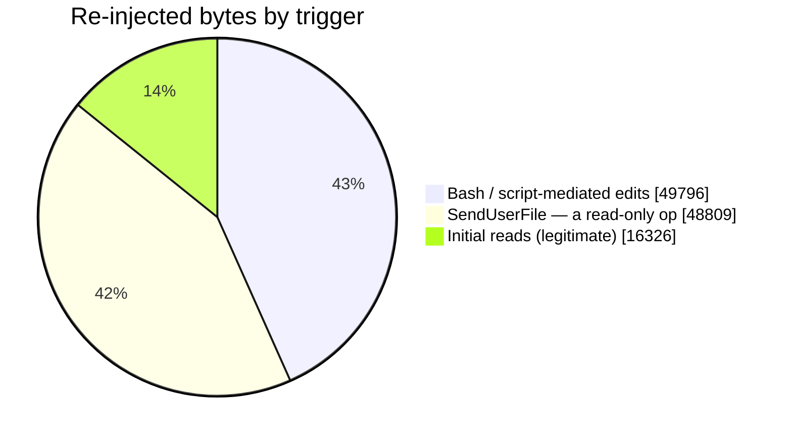
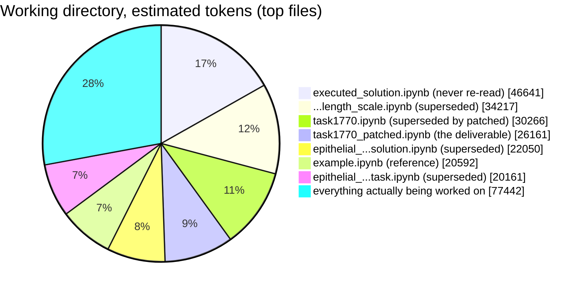
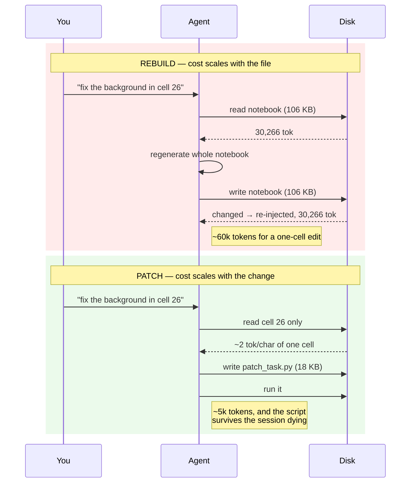
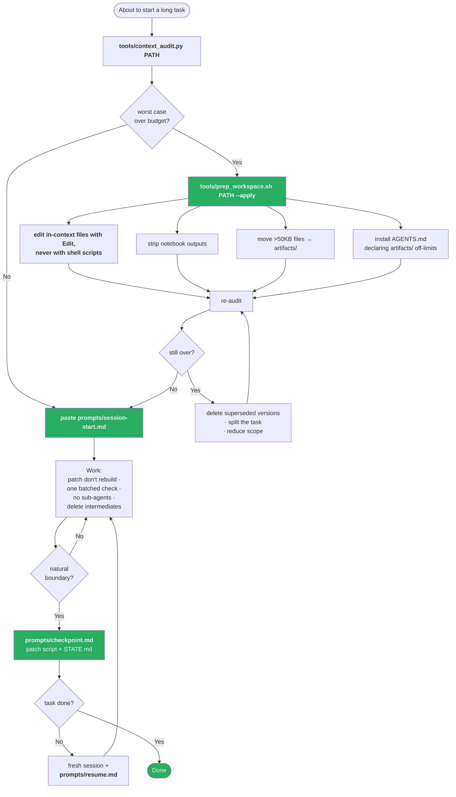
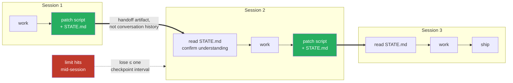

# 00 — Diagrams

Six pictures: the mechanism, where the cost went, what it compounds into, how to
fix it, and how a long task should be shaped. All Mermaid, so they render inline
on GitHub.

---

## 1. The mechanism — what decides whether an edit is free

Everything turns on one fork: **can the harness attribute the change to itself?**



The re-sync itself is **correct behaviour** — an agent patching against a stale
copy produces broken patches. What makes it expensive is that it re-sends a slice
of the file when it could send a diff, and that it sometimes sends the same bytes
twice.

The left branch is the whole mitigation: an `Edit` costs nothing because the
harness already knows what changed.

> Status: **measured**, from the session transcript via
> [`tools/transcript_forensics.py`](../tools/transcript_forensics.py). Only the
> queue-flush explanation for the duplicates is inferred; the duplicates
> themselves are byte-identical and counted. Full write-up:
> [07-the-actual-bug.md](07-the-actual-bug.md).

---

## 1b. Anatomy of the 28 re-injections

Where the 114,931 re-injected bytes came from, by what preceded them.



Two of the twenty-eight were genuine first reads. The other twenty-six were
re-syncs of files already in context — and **not one** followed an `Edit` or
`Write`.

The `SendUserFile` slice is the damning one. It modifies nothing; it cannot
dirty a file. Yet it is the largest single trigger by count. That is not
detection, it is a pending queue flushing at a turn boundary — and since 34.4%
of all re-injected bytes were byte-identical repeats, the queue evidently is
not emptied by a successful flush.

---

## 2. What it actually cost here

The measured directory, by weight. Everything in red was **never read again**
after the round that produced it.



Of 277,530 estimated tokens, roughly **173,000 were dead weight** — build
output and superseded versions. The task itself was the small slice.

---

## 3. The two habits that compound it

Same one-line change, two ways of applying it.

> **Read with diagram 1 in mind.** The patch script wins here *because the
> notebook was never read into context*. Run the same script against a file the
> agent has already read and you pay for the script **and** a full re-sync — see
> the corrected rule in [03-mitigations.md](03-mitigations.md#m4--emit-a-patch-script-never-a-rebuilt-file).



---

## 4. The fix, as a decision tree



Measured effect of the two green boxes at the top: **277,530 → 40,314 estimated
tokens**, 5.5× a 200k budget down to 0.8×.

---

## 5. Shape of a long task

The point of checkpointing is not tidiness. It is that a session you can
abandon cheaply is never a disaster.



Contrast with the failure mode this repo documents: a sub-agent measurement
running with no on-disk checkpoint, killed by the limit, producing **no**
result rather than a partial one — and the earlier attempts had already been
deleted, so it could not even be diagnosed after the fact.

---

## Rendering these elsewhere

GitHub renders Mermaid in Markdown natively. For slides or a doc:

```bash
npx -y @mermaid-js/mermaid-cli -i docs/00-diagrams.md -o out.md
```

which writes each diagram out as an SVG alongside. Pre-rendered SVGs are also checked in for contexts with no Mermaid support:

| file | what |
|---|---|
| [`img/overview.svg`](img/overview.svg) | before/after summary (README hero) |
| [`img/problem.svg`](img/problem.svg) | diagram 1, the amplification loop |
| [`img/solution.svg`](img/solution.svg) | diagram 4, the fix as a decision tree |

These were generated with `htmlLabels: false` so the text is real `<text>`
rather than `foreignObject` — the latter renders in a browser but not when
GitHub serves the SVG through an `` tag.
