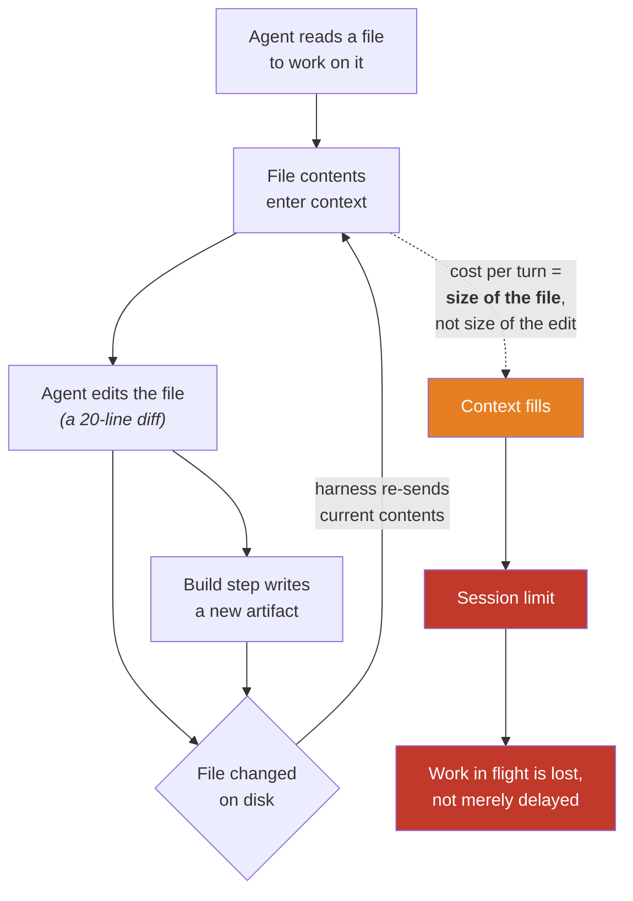
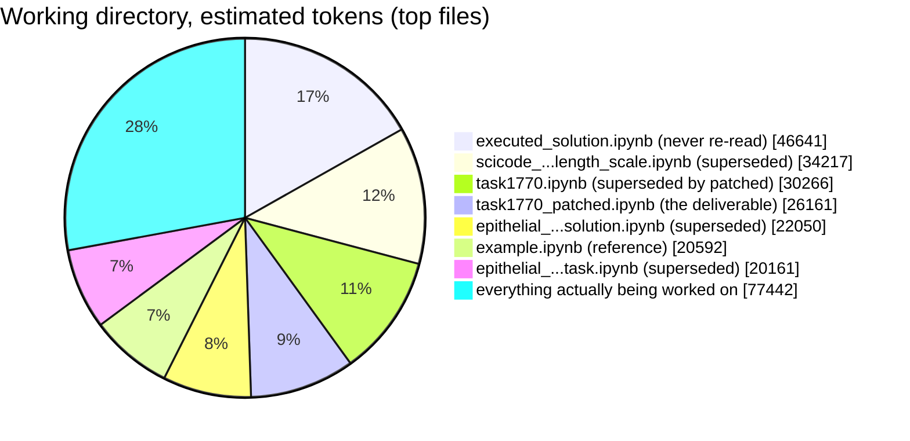
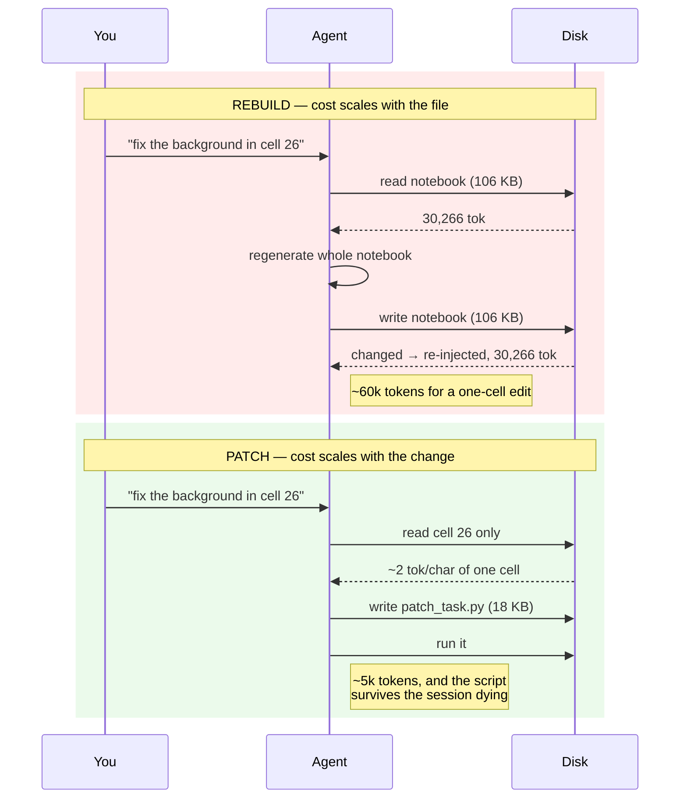
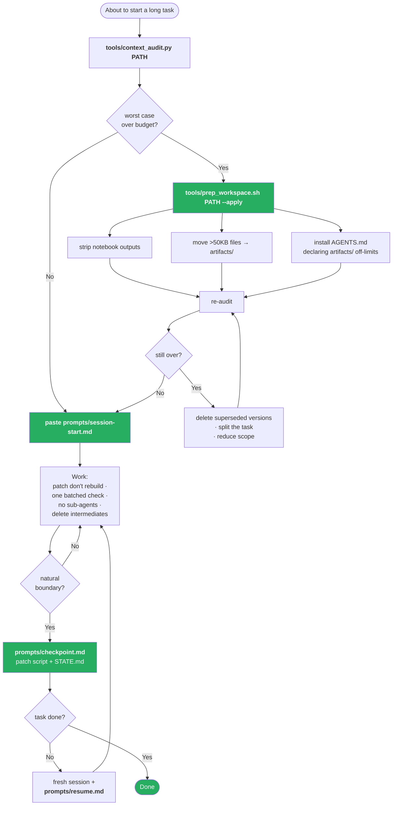
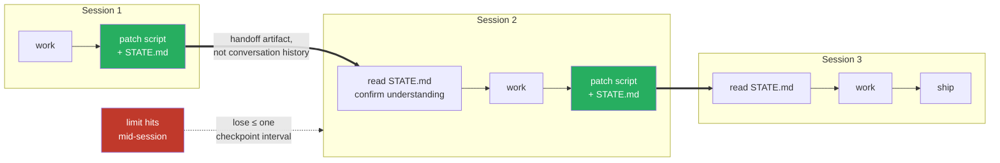

# 00 — Diagrams

Five pictures: what the problem is, why it compounds, what it costs, how to fix
it, and how a long task should be shaped. All Mermaid, so they render inline on
GitHub.

---

## 1. The problem, in one picture

Each turn re-pays for the whole working directory, not for the size of the
change.



The loop `B → C → D → B` is the whole story. It is correct behaviour — an agent
editing against a stale copy of a file produces broken patches — but it means
the steady-state cost of a turn is set by **what is in the directory**, not by
what you asked for.

> Status: the re-injection step is inferred, not directly observed. See
> [02-root-cause.md](02-root-cause.md).

---

## 2. What it actually cost here

The measured directory, by weight. Everything in red was **never read again**
after the round that produced it.



Of 277,530 estimated tokens, roughly **173,000 were dead weight** — build
output and superseded versions. The task itself was the small slice.

---

## 3. The two habits that compound it

Same one-line change, two ways of applying it.



---

## 4. The fix, as a decision tree



Measured effect of the two green boxes at the top: **277,530 → 40,314 estimated
tokens**, 5.5× a 200k budget down to 0.8×.

---

## 5. Shape of a long task

The point of checkpointing is not tidiness. It is that a session you can
abandon cheaply is never a disaster.



Contrast with the failure mode this repo documents: a sub-agent measurement
running with no on-disk checkpoint, killed by the limit, producing **no**
result rather than a partial one — and the earlier attempts had already been
deleted, so it could not even be diagnosed after the fact.

---

## Rendering these elsewhere

GitHub renders Mermaid in Markdown natively. For slides or a doc:

```bash
npx -y @mermaid-js/mermaid-cli -i docs/00-diagrams.md -o out.md
```

which writes each diagram out as an SVG alongside. Pre-rendered SVGs are also checked in for contexts with no Mermaid support:

| file | what |
|---|---|
| [`img/overview.svg`](img/overview.svg) | before/after summary (README hero) |
| [`img/problem.svg`](img/problem.svg) | diagram 1, the amplification loop |
| [`img/solution.svg`](img/solution.svg) | diagram 4, the fix as a decision tree |

These were generated with `htmlLabels: false` so the text is real `<text>`
rather than `foreignObject` — the latter renders in a browser but not when
GitHub serves the SVG through an `` tag.
